<style>
.blur {
    filter: blur(3px);
    display: inline-block;
}
.blur:hover {
    filter: none;
}
</style>
# 英语语法

## I.动词 (Verb)

### I.情态动词
情态动词没有人称和数的变化，在与第三人称单数形式he/she连用时，不需要加s。在任何句型中，后面都必须加动词原形。

### II.规则动词与不规则动词

#### 1.动词按照过去式和过去分词的形式，分为规则动词和不规则动词。

* 规则动词（regular verbs）

    绝大多数的动词都是规则动词。则动词是指过去式和过去分词由词加上-d（动词结尾是e）或-ed式构成的词。如：roll, rolled, rolled love, loved, loved有些单词词尾需要双写后加-ed。如：plan, planned, planned

* 不规则动词（irregular verbs）

    不规则动词的过去式和过去分词没有变化规律。在英语中大约有250个不规则动词。尽管没有规律可循，但是也有一些较常见的格式：
    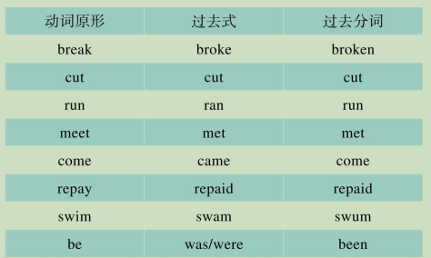

#### 2.区分规则动词与不规则动词

规则动词的过去式和过去分词一致，且都是动词加-ed的形式；除了规则动词之外的都属于不规则动词。

#### 3.动词的过去式和过去分词

动词的过去分词形式有以下三类：
```
1. 用在完成时态中：I have spoken. 我已经说了。
2. 用在被动语态中：The letter was written. 信已经写了。
3. 用作形容词形式：I was bored to death. 我无聊得要死
```

#### 4.动词过去式与过去分词的记忆
规则动词的过去分词形式与过去式形式相同，动词词尾加-ed形式。不规则动词的过去分词没有特殊的变化规律，需要特殊记忆。我们分成几类来记忆：
1. 过去式与过去分词同形的动词
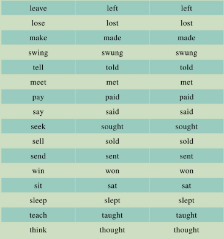
2. 原形与过去分词相同的动词
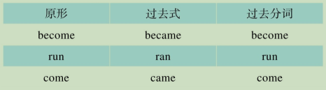
3. 原形、过去式和过去分词同形的动词
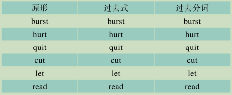
4. 原形、过去式和过去分词都不同的动词

    1.有变化规律的
    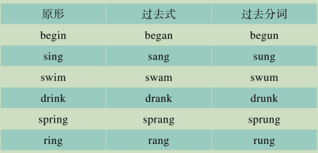
    2. 过去式加n变过去分词的
    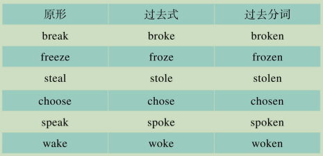
    3. 原形加n变过去分词的
    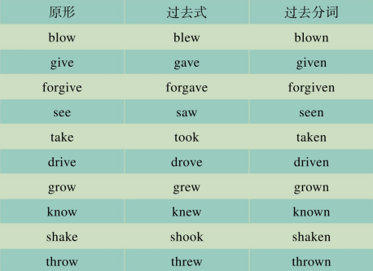
    4. 动词原形加ne或en变过去分词的

    > 动词原形加ne变过去分词
    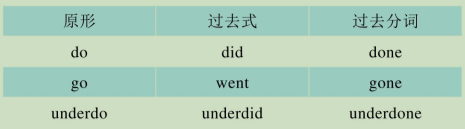
    
    > 动词原形加en变过去分词
    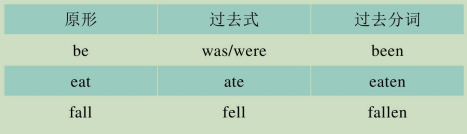

    5.过去分词在原形或过去式的词尾双写加en的动词
    > 原形词尾双写加en变过去分词
    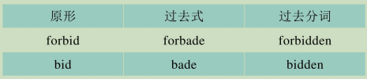

    > 过去式词尾双写加en变过去分词
    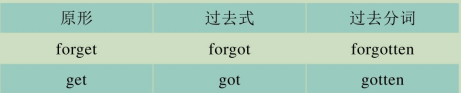

    6.其它不规则变化
    
    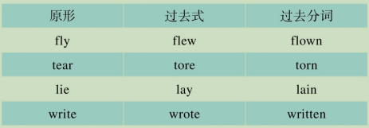

### III.动词的现在分词
动词的现在分词形式是动词的-ing形式。有以下三种：
```
1. 在进行时态中：I am speaking. 我在讲话。
2. 作形容词：The film is interesting. 这部电影很有趣。
3. 作动名词：He is afraid of flying. 他很害怕飞行。
```
#### 1.现在分词的特殊形式

1. 以e结尾的动词变现在分词，去e加ing。
come—coming
move—moving
take—taking
    > **以ee结尾的则直接加-ing，如agree—agreeing**
2. 在短暂强调的元音之后以辅音结尾的词，双写词尾加-ing。
sit—sitting
begin—beginning
swim—swimming
3. 以ie结尾，把ie变y再加ing。
lie—lying
die—dying
tie—tying
4. 元音之后以辅音l结尾的，双不双写l都可。
travel—travelling（英式）
travel—traveling（美式）

### IV.动词不定式
动词不定式（infinitive）是由动词前面加上to构成的，可作名词、形容词或者副词。如：
He was made to clean his room.
他被要求打扫他的房间。
#### 1.动词不定式的特性

1. 不定式是由to加动词构成的，具有动词的特性，有时态和语态的变化。
时态变化：to do/to be done/to have done/to be doing
语态变化：主动语态：to do/to be doing/to have done
被动语态：to be done/to have been done

1. 不定式可以在句中做主语、直接宾语、主语补足语、形容词或副词。

#### 2.动词不定式与介词短语的区别
不定式：to fly, to draw, to become, to enter, to stand, to catch, to belong
介词短语：to him, to the committee, to my house, to the mountains, to us, to this address

不定式是to加动词的形式，而介词短语是由to加名词、代词等构成。

## II.分词（participle）

分词（participle）是英语中一种特殊的非谓语动词形式，主要包括现在分词（present participle，动词+ing）和过去分词（past participle，规则动词一般为动词+ed，不规则动词有特殊变化）。分词既具有动词的特性，也可以像形容词一样修饰名词或作表语。现在分词通常表示主动和进行的含义，如：The running water（流动的水）；过去分词则多表示被动和完成的含义，如：The broken window（被打破的窗户）。

分词在句中可以作定语、状语、表语和补语。例如：Feeling tired, he went to bed early.（作状语）/ The book written by him is popular.（作定语）分词结构可以使句子更加简洁和生动，是英语写作和阅读中常见的重要语法点。

> 评论：分词是连接动词和形容词功能的桥梁，掌握分词的用法不仅有助于理解复杂句型，还能提升英语表达的准确性和多样性。学习分词时要注意其主动与被动、进行与完成的区别，以及与主句主语的一致关系。
> 
## III.动名词 （gerund）

动名词（gerund）是指动词+ing形式构成的名词。因此，动名词具有名词的性质，可以作主语、直接宾语、主语补足语和介词宾语。


## IV.代词 （Pronoun）
代词是指在句子中可以代替名词的词。

#### 1.代词的类别
代词主要分为以下七类：人称代词、指示代词、物主代词、反身代词、关系代词、疑问代词和不定代词。

##### 疑问代词（interrogative pronoun）

##### 不定代词（indifinite pronoun）

## V.数词 （Numbers）

### 基数词 （cardinal numbers）

### 序数词 （ordinal numbers）

### 读法

- 序数词的读法
在读序数词时，在序数词前面要加上the，如the first 1st， the fifth 5th等。

- 分数的读法
分数的表示方法是：分子用基数词，分母用序数词。如1/3 one third，1/4 one 
quarter或 one fourth，1/2 one half。

    >1/2只能读作one half不能读作one second。

另外五又二分之一的表示方法是在整数与分数之间加and：five and a half。

- 小数的读法
小数的读法要用到point，小数点后面的数字是各发各音的，例如：1.25读作one point two five。

- 日期的读法

## VI.形容词 （Adjective）

## VII.副词 （Adverb）

## VIII.虚词（）


### 冠词 （Artical）

定冠词
不定冠词

### 连词（Conjunction）

#### 并列连词 （Coordinating Conjunctions）

* FANBOYS（并列连词缩写）

Coordinating conjunctions are used to connect words, phrases, or clauses that are of equal importance in a sentence. The most common coordinating conjunctions in English can be remembered by the acronym FANBOYS:

- **F**or
- **A**nd
- **N**or
- **B**ut
- **O**r
- **Y**et
- **S**o

Each of these conjunctions serves a different purpose:

- **For**: explains reason or purpose (similar to "because")
    - *I went to bed early, for I was very tired.*
- **And**: adds one thing to another
    - *She bought apples and oranges.*
- **Nor**: presents a non-contrasting negative idea
    - *He doesn’t drink milk, nor does he eat cheese.*
- **But**: shows contrast
    - *I wanted to go, but I was busy.*
- **Or**: presents an alternative or choice
    - *Would you like tea or coffee?*
- **Yet**: introduces a contrasting idea that follows logically
    - *It was raining, yet we went hiking.*
- **So**: shows result or effect
    - *She was hungry, so she made a sandwich.*


#### 从属连词 （Subordinating Conjunctions）

#### 关联词 （Associated Word）

#### 介词 （Preposition）

#### 感叹词 （Interjection）

## IX.句子 1 （Sentence）

### 陈述句 (Declarative Sentence)

### 祈使句 (./Resources/imperative Sentence)

### 感叹句 （Exclamatary Sentence）
### 疑问句 (./Resources/interrogative Sentence) 

#### 一般疑问句 

#### 特殊疑问句
#### 反义疑问句
#### 选择疑问句

### 反问句


## X.句子 2

### 主语（Subject）

### 谓语（Predicate）
### 表语 (Predicative)

### 宾语（Object）

#### 双宾语（Double Object）

#### 复合宾语（Complex Object）

### 定语（Attribute）

### 状语（Adverbial）
描述句子具体信息，修饰动词、形容词、副词或整个句子。
比如时间，地点，原因，目的，方式等。

<span class="blur">
详细解释：

状语（Adverbial）用来补充说明动作发生的时间、地点、方式等。
在这个句子里，“在通勤的途中”说明了背单词这个动作发生的时间或地点。

“在通勤的途中”是状语，英文表达为“on the way to work”或
“during the commute”。

</span>


他在通勤时听英文歌。
**He listens to English songs during the commute.**

---

许多上班族会在通勤的途中背单词。

**Many office workers memorize words on the way to work.**


---


### 补语（Complement）

补充主语和宾语的成分。

#### 宾语补足语

#### 主语补足语
主语补足语分为两种类型：表语形容词和名词性谓语。

## XI.句型 (Sentence Patterns)

句型是指句子的基本结构。掌握常见的英语句型，有助于我们正确表达意思。

### 五种基本句型

1. 主语 + 谓语 (S + V)
    - 例：Birds sing. 鸟儿唱歌。
主谓一致 

1. 主语 + 谓语 + 宾语 (S + V + O)
    - 例：I like apples. 我喜欢苹果。

2. 主语 + 系动词 + 表语 (S + V + P)
    - 例：She is a teacher. 她是一名老师。
  
3. 主语 + 谓语 + 宾语 + 宾语补足语 (S + V + O + OC)
    - 例：They call me Tom. 他们叫我汤姆。

4. 主语 + 谓语 + 间接宾语 + 直接宾语 (S + V + IO + DO)
    - 例：He gave me a book. 他给了我一本书。

### There Be 句型

### 省略句 (Elliptical Sentence)
省略句（elliptical sentence）是指为了避免不必要的重复、保持句子简洁，在语境成立的情况下省略某些句子成分的句子。区分省略句有两种方式：一种是语篇省略和情景省略，另一种是简单句省略、并列句省略和复合句省略。

这些句型是英语句子的基础.

### 倒装句（Inverted Sentence）

完全倒装定义是指将句子的主语和谓语动词颠倒位置，以强调某个成分或使句子更具表现力。

部分倒装是指在某些特定情况下，仅对句子的一部分进行倒装，通常是为了强调某个副词或状语。

### 强调句 （Emphatic Sentence）

### 祈使句 （Imperative Sentence）

## XII.从句 （Clause）


### 名词性从句 （Noun Clause）

名词性从句是充当名词的从句，可以在句中作主语、宾语、表语或同位语。


#### 主语从句 （Subject Clause）
#### 宾语从句 （Object Clause）
#### 表语从句 （Predicative Clause）
#### 同位语从句 （Appositive Clause）

### 定语从句 （Attributive Clause）

#### 限定性定语从句 （Defining Relative Clause）
#### 非限定性定语从句 （Non-defining Relative Clause）


### 状语从句 （Adverbial Clause）

#### 时间状语从句 （Adverbial Clause of Time）
#### 地点状语从句 （Adverbial Clause of Place）
#### 原因状语从句 （Adverbial Clause of Reason）
#### 结果状语从句 （Adverbial Clause of Result）
#### 目的状语从句 （Adverbial Clause of Purpose）
#### 让步状语从句 （Adverbial Clause of Concession）
#### 条件状语从句 （Adverbial Clause of Condition）
#### 比较状语从句 （Adverbial Clause of Comparison）
#### 方式状语从句 （Adverbial Clause of Manner）

## XIII.时态 （Tense）
### 现在 (Present Indefinite Tense)
一般现在时
 - 动词原形（第三人称单数动词加s或es）
现在进行时
- be + 动词ing
现在完成时
- have/has + 过去分词


### 过去 (Past Indefinite Tense)
一般过去时

过去进行时
过去完成时
### 将来 (Future Indefinite Tense)
一般将来时

- will + 动词原形
- be going to + 动词原形
将来进行时

- will be + 动词ing
- be going to be + 动词ing

将来完成时

- will have + 过去分词
- be going to have + 过去分词'
  

## XIV.语态 （Voice）
语态是指主语所执行的动作。英语中有两种语态：主动语态和被动语态。
### 主动语态 （Active Voice）
主动语态是指句中主语是动作的执行者，强调动作的发出者。主动语态的构成通常是“主语 + 动词 + 宾语”。

### 被动语态 （Passive Voice）
被动语态是指主语是动作的承受者，强调动作的影响或结果。被动语态的构成通常是“be + 过去分词”。
有时，被动语态使用动词get，不使用动词be

被动语态的时态变化：
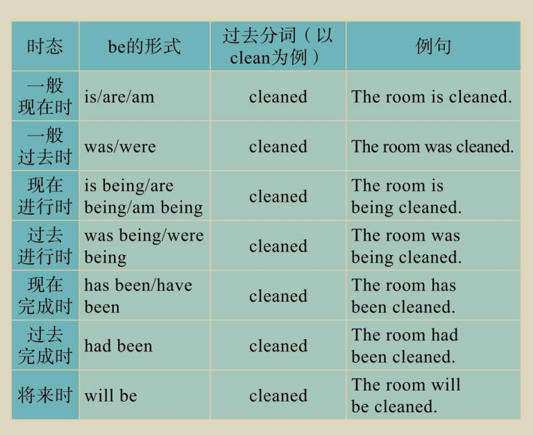

get done
have done


## XV.虚拟语气 （Subjunctive Mood）
虚拟语气用于表达与事实相反的情况、假设、愿望或建议。英语中的虚拟语气主要有以下几种形式：

根据动词的时态和语态，表示虚拟过去对现在、将来或过去的情况。

if 

wish

that


